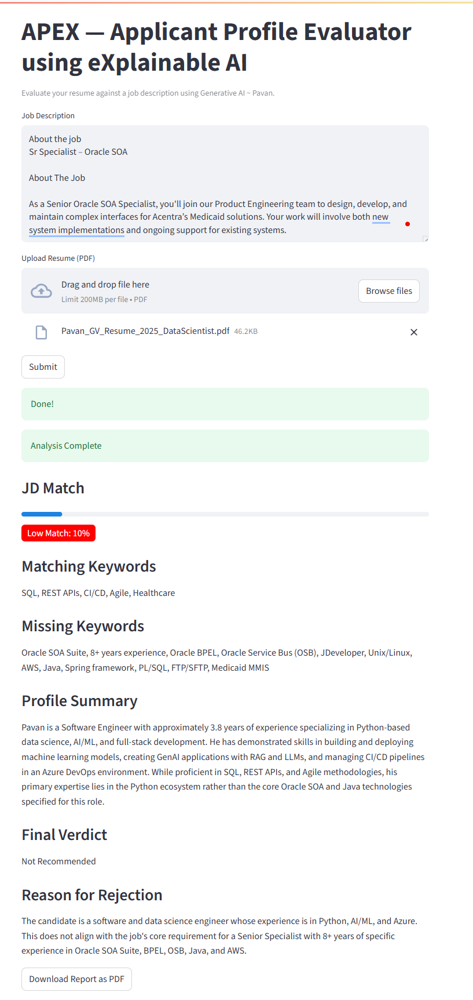

# APEX — Applicant Profile Evaluator using Explainable AI

APEX is a Generative AI-powered resume screening tool that intelligently analyzes candidate resumes against job descriptions (JDs). It delivers ATS-style keyword scoring, semantic similarity evaluations, and LLM-driven contextual recommendations through a Streamlit-based interface.

---

## Preview

  
  
  


---

## Features

- Upload candidate resume (PDF) and job description (PDF)
- Extract content from both documents
- Calculate ATS Score using keyword vector match
- Compute Semantic Match Score using sentence embeddings
- Generate LLM-based fit evaluation using Google Gemini
- Display all results via Streamlit UI
- Download detailed evaluation report as a PDF

---

## What Did We Build?

The **APEX tool** helps recruiters and hiring managers quickly assess whether a candidate is a good fit for a job role by:

- Parsing and extracting resume content from PDFs
- Comparing resume content with a provided job description
- Calculating:
  - **ATS Score** (keyword match score)
  - **Semantic Match Score** (vector similarity)
  - **LLM-generated Feedback** (using Google's Gemini / Generative AI)
- Generating a final recommendation with reasons
- Displaying all results on a **Streamlit dashboard**
- Optionally exporting the evaluation to a PDF report

---

## Tech Stack & Tools Used

### Core Programming
- Python 3.10+

### Frontend
- Streamlit

### Resume & JD Parsing
- PyPDF2

### AI, LLMs, and NLP
- Google Generative AI (`google-generativeai`)
- SentenceTransformers (`all-MiniLM-L6-v2`)
- spaCy, regex for keyword processing

### Scoring
- Scikit-learn for CountVectorizer and cosine similarity

### Report Generation
- ReportLab

### Secrets & Config
- python-dotenv

---

## Workflow

```
1. Upload resume and job description PDFs
2. Extract content using PyPDF2
3. Generate semantic embeddings using SentenceTransformers
4. Compute ATS score using keyword-based vector comparison
5. Use Gemini Pro (Google Generative AI) to evaluate contextual fit
6. Display all scores and recommendations on the UI
7. Export results to PDF (optional)
```

## APIs and Models Used


### Google Generative AI (Gemini Pro)
- Accessed via `google-generativeai` Python SDK
- Evaluates how well a resume aligns with a job description
- Output includes:
  - Fit summary
  - Overlapping and missing skills
  - Recommendation score and rationale

### Sentence Transformers
- Model: `all-MiniLM-L6-v2` (from Hugging Face)
- Converts JD and resume into vector embeddings
- Computes cosine similarity for semantic match scoring

---

## How to run the project

- **Clone the project**: 
```bash
git clone https://github.com/your-username/apex.git
cd apex
```
- **Install dependencies**: 
```
pip install -r requirements.txt
```
- **Create a .env file in the root directory**:
```
GOOGLE_API_KEY=your_google_api_key_here
```
- **Run the streamlit app**:
```
 streamlit run apex.py
```
## sample requirements.txt
- streamlit
- google-generativeai
- python-dotenv
- PyPDF2
- reportlab
- sentence-transformers
- scikit-learn

## Directory Structure
apex/
├── apex.py
├── README.md
├── requirements.txt
├── .env.example
├── images/
│   ├── APEX1.png
│   ├── APEX2.png
│   ├── APEX3.png
│   └── APEX4.png

## Future enhancements
- Support .docx and .txt formats
- Batch resume evaluations
- Role-specific keyword tuning
- Cloud integration for storing candidate results
- Authentication layer for internal HR teams
- Email reports to recruiters

## Author
**Pavan G V**
- Aspiring AI/ML Engineer focused on building production-ready Generative AI and data-driven applications.

## License

This project is open-source and available under the MIT License.  
See the [LICENSE](LICENSE) file for details.
